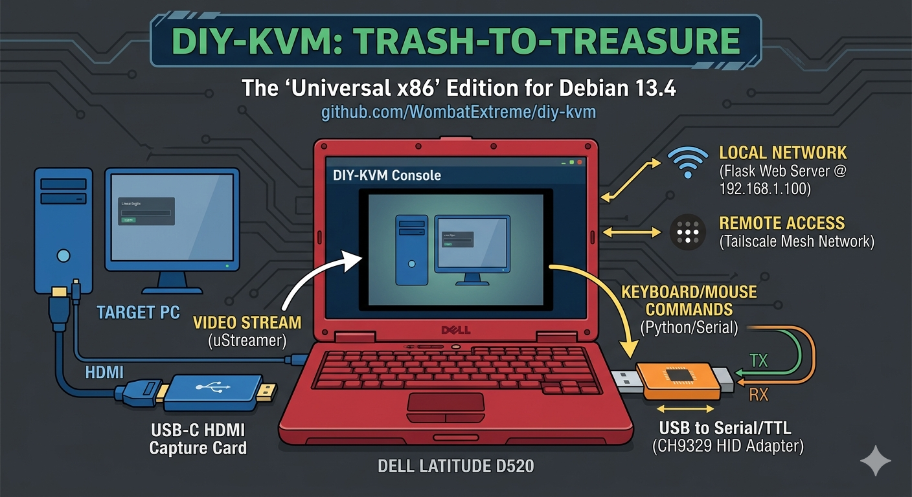

# 🛠️ DIY-KVM: The Trash-to-Treasure Edition

> **Turn any old x86 laptop into a professional-grade IP-KVM for ~$25.**

## ✨ Features
* **Zero-Config Video:** Low-latency MJPEG streaming via uStreamer.
* **HID Keyboard/Mouse:** Driverless control via CH9329 serial adapter.
* **Virtual Media:** Boot ISOs over the network with integrated Netboot.xyz.
* **Remote Access:** Built-in Tailscale support to bypass firewalls.
* **Hardware Recycling:** Optimized for legacy dual-core systems like the Dell D520.
❓ Frequently Asked Questions (FAQ)

Q: Does the target PC need special drivers?
A: No. Because we use the CH9329 HID chip, the target PC thinks a standard keyboard and mouse are plugged in. It works in the BIOS/UEFI, Blue Screens, and even during OS installation.

Q: Can I access this from my phone?
A: Yes! Since the script installs Tailscale, you can open the Tailscale app on your phone, connect to your "KVM laptop" IP, and control your server from anywhere in the world.

Q: Why use an old laptop instead of a Raspberry Pi?
A: Raspberry Pis are great, but many people have old laptops like the Dell D520 gathering dust. This project gives that hardware a new life, includes a built-in screen/keyboard for local troubleshooting, and costs $0 if you already own the laptop.

Q: What if the video is laggy?
A: On older dual-core systems (like the D520), the CPU might struggle with high-bitrate encoding. The script is optimized for 1280x720, but you can drop it to 800x600 in the Dockerfile for near-zero latency on legacy hardware.

USB 2.0 Power: On the D520, use the rear USB ports for the capture card if possible; they often provide more stable voltage than the side ports.

Video Lag: If the stream is laggy, the D520 CPU might be hitting 100%. Reducing the resolution in the Dockerfile to 800x600 is a pro-move for older dual-core systems.

Part,Approx. Cost,Purpose
HDMI Capture Card,$3.59,Captures video from the target PC. 
CH9329 USB Adapter,$1.76 ,Sends keystrokes to the target PC.
Old Laptop (D520),Free/E-waste,Acts as the KVM server & Tailscale node.
👨‍💻 Technical Credits & Inspiration

The "Why" behind the project:
As a System Administrator who has been building PCs for nearly 30 years, I believe in functional longevity. Throwing away a perfectly good Dell Latitude D520 just because it's "old" is a waste of engineering. This project was born from the need to have a professional-grade IP-KVM without the $500 enterprise price tag.

Built With:

    uStreamer: The high-performance video streaming engine that makes low-latency remote console access possible.

    Flask: A lightweight Python web framework used for the control interface.

    Tailscale: For secure, zero-config mesh networking that bypasses firewalls and CGNAT.

    CH9329 HID Protocol: Utilizing the standard USB HID class for driverless keyboard and mouse injection.
	
	🤝 Support & Contributions

Have a question or a hardware quirk?
Since this project is designed for a wide range of "legacy" x86 hardware (from my Dell D520 to modern mini-PCs), you might run into a specific USB power or video resolution issue.

    Issues: If the script fails or you find a bug, please open an Issue on this repository.

    Hardware Success: If you successfully ran this on a unique piece of hardware, let me know! I'd love to add a "Verified Hardware" list to this README.

    Contributions: Pull Requests are welcome! If you want to add a Dark Mode toggle, a "Virtual Media" mount feature, or support for other HID adapters, feel free to submit a PR.

## 🚀 Quick Start
Run this on a fresh install of **Debian 13 (Trixie)**:
`curl -sSL https://raw.githubusercontent.com/WombatExtreme/diy-kvm/main/install_kvm.sh | bash`

